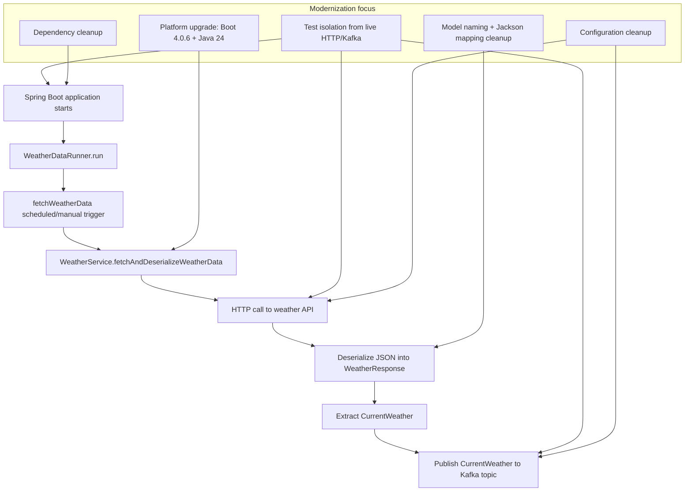

# Work-Order — Code Review and Modernization (`2026-05-06`)

## 1. Goal statement

Modernize the full `weather_app_kafka` application to current project-approved baselines by reviewing all layers for industry-standard best practices, upgrading Spring Boot from `4.0.4` to `4.0.6`, upgrading Java from `21` to `24`, and updating the existing test suite so the application remains verifiable without relying on live external systems during tests.

---

## 2. Scope

### In scope

#### Build and dependency management
- `pom.xml`
  - Upgrade Spring Boot parent from `4.0.4` to `4.0.6`.
  - Upgrade Java release from `21` to `24`.
  - Reassess direct dependencies for redundancy and drift from Boot-managed BOM:
    - `spring-boot-starter-logging`
    - `jackson-databind`
    - `mockito-core`
  - Review Maven plugin configuration for Java 24 readiness and test execution stability.
  - Address Mockito dynamic-agent warnings in a forward-compatible way if needed.

#### Application bootstrap and scheduling
- `src/main/java/nh/weather_app_kafka/WeatherAppKafkaApplication.java`
  - Keep application startup intact.
  - Verify Boot 4.0.6 + Java 24 compatibility.
- `src/main/java/nh/weather_app_kafka/runner/WeatherDataRunner.java`
  - Review startup trigger behavior and scheduled execution.
  - Review constructor injection style and exception signature.
  - Ensure scheduler behavior remains explicit and testable.

#### Configuration layer
- `src/main/java/nh/weather_app_kafka/config/AppConfig.java`
  - Review bean definitions for HTTP client and JSON mapper.
  - Evaluate modernization of HTTP client choice if supported by Boot 4 best practices.
- `src/main/java/nh/weather_app_kafka/config/KafkaConfig.java`
  - Review producer configuration, topic creation, and hard-coded topic parameters.
  - Review whether configuration should move to typed properties / constants.
  - Validate Boot 4 / Kafka client compatibility assumptions.
- `src/main/resources/application.properties`
  - Review property syntax and consistency.
  - Review whether properties should be normalized and grouped.
  - Keep API URL and Kafka bootstrap/topic behavior stable unless explicitly revised in implementation approval.

#### Domain/model layer
- `src/main/java/nh/weather_app_kafka/model/CurrentWeather.java`
  - Review naming conventions, serialization compatibility, null-safety, and maintainability.
  - Review whether snake_case Java member names should be replaced with Java-standard camelCase plus Jackson mapping.
  - Review generated methods / equality requirements for tests.
- `src/main/java/nh/weather_app_kafka/model/WeatherResponse.java`
  - Review Jackson mapping, encapsulation, and suitability for typed deserialization.

#### Service layer
- `src/main/java/nh/weather_app_kafka/service/WeatherService.java`
  - Review constructor injection style.
  - Review field visibility and logger declaration.
  - Review responsibility split across:
    - `fetchAndDeserializeWeatherData()`
    - `fetchWeatherData()`
    - `deserializeWeatherData(String response)`
    - `pushWeatherDataToKafka(CurrentWeather currentWeather)`
  - Review exception handling, logging quality, Kafka publish behavior, and external-call resilience.
  - Review whether method/package visibility exists only to support current tests and whether tests should instead target public behavior.

#### Tests
- `src/test/java/nh/weather_app_kafka/WeatherAppKafkaApplicationTests.java`
  - Prevent accidental live API/Kafka behavior during context startup tests.
- `src/test/java/nh/weather_app_kafka/runner/WeatherDataRunnerTest.java`
  - Review unit test clarity, naming, and Mockito setup.
- `src/test/java/nh/weather_app_kafka/service/WeatherServiceTest.java`
  - Review property injection strategy, brittleness, and coverage gaps.
  - Update tests to reflect any approved production refactors.
- New tests may be added under:
  - `src/test/java/nh/weather_app_kafka/config/`
  - `src/test/java/nh/weather_app_kafka/model/`
  - `src/test/java/nh/weather_app_kafka/service/`
  - `src/test/java/nh/weather_app_kafka/runner/`

#### Operational docs / local runtime support
- `docker-compose.yml`
  - Review outdated local Kafka stack choices and modernization opportunities.
  - Document whether current stack remains acceptable for local development after Java/Spring upgrade.
- `HELP.md`
  - Update local run instructions if build, Docker, Java, or test setup changes.

### Explicitly out of scope unless separately approved later
- Adding new business features unrelated to weather retrieval/publishing.
- Changing the weather API provider.
- Introducing a database or repository layer.
- Changing Kafka topic name, polling cadence, or message contract unless required for compatibility and explicitly approved during implementation.

### Assumptions to preserve during implementation
- The application should continue fetching weather data and publishing current weather events to Kafka.
- The existing Kafka topic property key and weather API property key should remain externally compatible unless approval is given to rename or restructure them.
- The scheduled fetch cadence should stay functionally equivalent unless a strong reason emerges during the test-first phase.

---

## 3. Design decisions

1. **Platform-first upgrade**
   - Upgrade the platform baseline first in `pom.xml` so dependency management stays coherent.
   - Prefer Boot-managed dependencies over redundant direct declarations.

2. **Constructor injection everywhere**
   - Remove redundant `@Autowired` on single constructors where applicable.
   - Favor immutable collaborators and explicit dependencies.

3. **Isolate side effects from tests**
   - Existing tests currently allow a real application context to invoke live HTTP/Kafka behavior.
   - Refactor and test so unit/integration tests do not require a reachable weather API or Kafka broker unless that is explicitly the purpose of a dedicated integration test.

4. **Java-standard naming in code, wire-format compatibility via Jackson**
   - Prefer camelCase Java fields and `@JsonProperty` mappings for JSON fields like `is_day`.
   - Preserve payload compatibility while improving code readability.

5. **Target resilience and observability, not broad architectural churn**
   - Improve logging, error handling, and configuration structure.
   - Keep the app small and understandable; avoid introducing complexity without a measurable benefit.

6. **TDD enforcement**
   - Phase 1 will create or update tests first.
   - No production source changes in Phase 1.
   - Phase 2 will implement the smallest changes necessary to make all approved tests pass.

---

## 4. Current findings informing this work-order

### Confirmed from repository inspection
- The project is a small Spring Boot Kafka producer app with these concrete layers:
  - bootstrap: `WeatherAppKafkaApplication`
  - config: `AppConfig`, `KafkaConfig`
  - model: `CurrentWeather`, `WeatherResponse`
  - runner: `WeatherDataRunner`
  - service: `WeatherService`
  - tests: application, runner, service tests
- There is **no controller** and **no repository** currently present.
- `application.properties` mixes `=` and `:` syntax.
- `WeatherService` uses field-level `@Value` injection, package-private helper methods, broad exception catching, and mutable logger declaration.
- `WeatherDataRunner` uses constructor injection but still keeps `@Autowired` on the constructor unnecessarily.
- `CurrentWeather` uses snake_case Java fields such as `is_day`, which is not idiomatic Java.
- `AppConfig` exposes `RestTemplate` and a raw `ObjectMapper` bean.
- `pom.xml` includes dependencies likely redundant under Spring Boot dependency management.
- `docker-compose.yml` uses an older ZooKeeper-based Confluent stack, which is acceptable as a local dev stack only if still intentional.

### Confirmed from baseline test run
- The current test suite starts a real Spring context and triggers live side effects.
- `WeatherAppKafkaApplicationTests` causes the app to call the live weather API and attempt Kafka connections during test execution.
- Kafka connection warnings occur when no broker is available.
- Mockito emits a dynamic Java-agent warning that becomes more relevant as the JDK moves forward.
- The current tests are therefore not fully isolated or industry-standard for stable CI.

### Confirmed from dependency assessment
- No known direct-dependency CVEs were identified from the currently declared direct dependencies.
- Upgrading Spring Boot to `4.0.6` is a sensible patch-level modernization baseline.
- Main dependency cleanup opportunity is reducing redundant direct declarations and relying more on the Boot BOM.

---

## 5. Flow diagram

---

## 6. Test plan — to be written first (TDD)

### Unit tests

1. **`WeatherDataRunner_run_invokesWeatherFetchOnce`**
   - Input: runner with mocked `WeatherService`
   - Expected result: `fetchAndDeserializeWeatherData()` called once
   - Type: unit

2. **`WeatherDataRunner_fetchWeatherData_invokesWeatherFetchOnce`**
   - Input: runner with mocked `WeatherService`
   - Expected result: `fetchAndDeserializeWeatherData()` called once
   - Type: unit

3. **`WeatherService_fetchAndDeserializeWeatherData_publishesCurrentWeather_whenApiAndDeserializationSucceed`**
   - Input: valid weather JSON and successful deserialization
   - Expected result: Kafka publish invoked with expected topic/key/payload
   - Type: unit

4. **`WeatherService_fetchAndDeserializeWeatherData_doesNotPublish_whenApiReturnsNull`**
   - Input: API returns `null`
   - Expected result: Kafka publish not invoked
   - Type: unit

5. **`WeatherService_fetchAndDeserializeWeatherData_doesNotPublish_whenDeserializationReturnsNull`**
   - Input: API returns JSON but deserialization yields `null`
   - Expected result: Kafka publish not invoked
   - Type: unit

6. **`WeatherService_fetchWeatherData_returnsResponseBody_whenHttpCallSucceeds`**
   - Input: mocked HTTP response string
   - Expected result: same string returned
   - Type: unit

7. **`WeatherService_fetchWeatherData_returnsNull_whenHttpCallThrows`**
   - Input: mocked exception from HTTP client
   - Expected result: `null` returned and no exception escapes
   - Type: unit

8. **`WeatherService_deserializeWeatherData_returnsCurrentWeather_whenJsonIsValid`**
   - Input: valid weather JSON
   - Expected result: populated `CurrentWeather`
   - Type: unit

9. **`WeatherService_deserializeWeatherData_returnsNull_whenJsonIsInvalid`**
   - Input: invalid JSON or mapper exception
   - Expected result: `null` returned and no exception escapes
   - Type: unit

10. **`WeatherService_pushWeatherDataToKafka_sendsExpectedKeyAndPayload`**
    - Input: `CurrentWeather`
    - Expected result: Kafka send invoked with stable key and payload
    - Type: unit

11. **`WeatherService_pushWeatherDataToKafka_swallowsOrHandlesPublishFailure_withoutThrowing`**
    - Input: Kafka send throws synchronously / collaborator failure
    - Expected result: no exception escapes current service contract
    - Type: unit

12. **`CurrentWeather_jsonMapping_preservesWireCompatibility_forSnakeCaseFields`**
    - Input: JSON containing `is_day`, `winddirection`, `weathercode`, etc.
    - Expected result: Java model maps correctly after naming cleanup
    - Type: unit

13. **`WeatherResponse_deserializesCurrentWeather_fromCurrentWeatherJsonProperty`**
    - Input: JSON with `current_weather`
    - Expected result: nested model correctly populated
    - Type: unit

14. **`KafkaConfig_weatherInputTopic_usesConfiguredTopicName`**
    - Input: configured topic name
    - Expected result: `NewTopic` bean uses configured name and expected partitions/replication/config
    - Type: unit

15. **`AppConfig_exposesRequiredInfrastructureBeans`**
    - Input: configuration class instantiation or sliced context
    - Expected result: required HTTP and JSON beans are present
    - Type: unit / lightweight integration

### Integration tests

16. **`ApplicationContext_loads_withoutTriggeringExternalCalls`**
    - Input: Spring test context with external collaborators mocked or scheduling disabled
    - Expected result: context loads successfully and does not hit live weather API or Kafka
    - Type: integration

17. **`ApplicationContext_bindsConfigurationProperties_correctly`**
    - Input: test property overrides for Kafka bootstrap, topic, API URL
    - Expected result: configuration wiring succeeds with explicit test values
    - Type: integration

18. **`WeatherService_endToEndWithinSpringContext_publishesUsingInjectedCollaborators`**
    - Input: Spring-managed service with mocked HTTP/Kafka collaborators
    - Expected result: main service flow works through the Spring context without external network dependencies
    - Type: integration

### Optional deferred tests
- Dedicated Kafka integration tests using `spring-kafka-test` may be added only if needed after Phase 1 review.
- Docker/local-stack validation is documentation-oriented unless runtime breakage is identified.

---

## 7. 🔴 PHASE 1 — Tests + walkthrough (execute first, then STOP)

When implementation begins, Phase 1 must:

1. Add or update the test files required by the plan above.
2. Keep production files untouched.
3. Ensure tests clearly document intended behavior before refactoring.
4. Include a numbered **Test Walkthrough** directly below the test code, explaining for every test:
   - what is asserted
   - why the case matters
5. End the Phase 1 response with exactly:

> _"All tests are written. Please review the code and walkthrough above. Reply with **'approved'** — or give feedback — before I write any production code."_

### Expected Phase 1 files
- `src/test/java/nh/weather_app_kafka/WeatherAppKafkaApplicationTests.java`
- `src/test/java/nh/weather_app_kafka/runner/WeatherDataRunnerTest.java`
- `src/test/java/nh/weather_app_kafka/service/WeatherServiceTest.java`
- Optional new test files under:
  - `src/test/java/nh/weather_app_kafka/config/`
  - `src/test/java/nh/weather_app_kafka/model/`

---

## 8. 🟢 PHASE 2 — Production code (only after explicit approval)

Ordered implementation steps after Phase 1 approval:

1. **Upgrade build baseline**
   - Update Boot and Java versions in `pom.xml`.
   - Remove unnecessary direct dependency declarations if tests confirm no need.
   - Add any required test/plugin configuration for Java 24 compatibility.

2. **Stabilize tests and context startup**
   - Prevent startup tests from calling live external systems.
   - Disable or isolate scheduling side effects in tests.

3. **Refine configuration layer**
   - Normalize property usage and decide whether typed configuration objects are warranted.
   - Keep external property names stable unless explicitly approved otherwise.

4. **Refactor service layer safely**
   - Improve injection style, logger declaration, and exception handling.
   - Keep behavior stable while improving readability and maintainability.

5. **Refactor model layer safely**
   - Move Java code toward camelCase naming with Jackson annotations preserving JSON compatibility.
   - Add equality or assertion-friendly patterns only if justified by tests.

6. **Review runner behavior**
   - Keep startup and scheduled invocation behavior intentional and testable.

7. **Review Kafka configuration**
   - Ensure topic configuration remains explicit and compatible.
   - Make low-risk cleanup only unless tests require further change.

8. **Review local runtime docs**
   - Update `HELP.md` and, if needed, `docker-compose.yml` guidance to match the new baseline.

9. **Run full verification**
   - Run Maven tests after each meaningful step and again at the end.
   - Confirm no test depends on live HTTP/Kafka by default.

---

## 9. Documentation updates

Update the following as part of implementation if changes are approved:
- `HELP.md`
  - Java 24 requirement
  - startup/test instructions
  - any changed local runtime expectations
- `pom.xml`
  - dependency and plugin intent made self-explanatory where useful
- Javadoc/comments in production code
  - only where behavior is non-obvious or configuration contracts need explanation

---

## 10. Definition of done

- [ ] Spring Boot upgraded from `4.0.4` to `4.0.6`.
- [ ] Java baseline upgraded from `21` to `24`.
- [ ] Redundant or outdated dependency declarations reviewed and cleaned up where safe.
- [ ] All existing layers in the repository reviewed for code quality and best practices.
- [ ] Existing tests updated as needed and new tests added where gaps are identified.
- [ ] Test suite runs without depending on live weather API calls or a live Kafka broker by default.
- [ ] Startup, scheduling, deserialization, and Kafka publish behavior remain covered by tests.
- [ ] JSON/wire compatibility is preserved for weather payload handling.
- [ ] Local documentation reflects any approved build/runtime changes.
- [ ] No production code is changed before Phase 1 tests are approved.

---

## 11. Approval gate

This work-order is ready for review.

**Next step:** if you approve this scope, reply with something like **`approved work-order`** and I will start **Phase 1 — tests only**.

