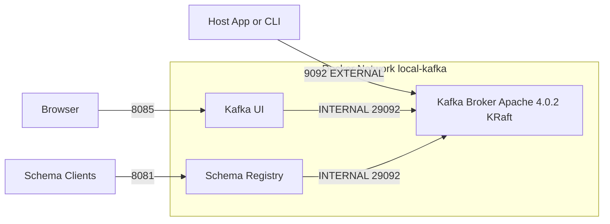

# Work-Order - Docker Compose Kafka Modernization (`2026-05-06`)

## 1. Goal statement

Modernize local Kafka infrastructure in `docker-compose.yml` by moving from ZooKeeper-based Confluent broker to single-node Apache Kafka `4.0.2` in KRaft mode, upgrading Kafka UI to latest, adding Schema Registry (latest), and preserving developer-friendly host access.

---

## 2. Scope

### In scope

#### Infrastructure definition
- `docker-compose.yml`
  - Remove `zookeeper` service entirely.
  - Replace `broker` image with `apache/kafka:4.0.2`.
  - Configure Kafka for **single-node KRaft** mode.
  - Keep Kafka host port `9092`.
  - Keep Kafka internal container port `29092`.
  - Use simplified listener names: `INTERNAL` and `EXTERNAL`.
  - Keep/add persistent named volume(s) for Kafka data.
  - Update `kafka-ui` image to `provectuslabs/kafka-ui:latest`.
  - Change Kafka UI host port from `7777` to `8085`.
  - Remove Kafka UI ZooKeeper settings.
  - Add `schema-registry` service using `confluentinc/cp-schema-registry:latest`.
  - Expose Schema Registry host port `8081`.
  - Wire Schema Registry to Kafka bootstrap server.

#### Verification artifacts (Phase 1 only)
- Add a test/verification checklist doc for compose validation:
  - `prompts/improvements/complete/verification-compose-kraft-schema-registry-2026-05-06.md`
  - Contains explicit verification commands and expected results.

### Explicitly out of scope
- Any Java production code changes under `src/main/java`.
- Any Java test refactors under `src/test/java`.
- Topic naming/partition behavior changes in application config.
- Security hardening beyond current PLAINTEXT local-dev defaults.

### Assumptions confirmed
- Single-node development setup is sufficient.
- `latest` tags are intentionally accepted for Kafka UI and Schema Registry.
- Success requires all of the following:
  - compose starts cleanly,
  - Kafka UI is reachable,
  - produce/consume smoke verification,
  - Schema Registry API reachable.

---

## 3. Design decisions

1. **KRaft over ZooKeeper**
   - Kafka runs in KRaft mode with no ZooKeeper service.

2. **Two-listener model for clarity**
   - `INTERNAL` listener for container network (`29092`).
   - `EXTERNAL` listener for host clients (`9092`).

3. **Dev-first operability**
   - Preserve easy local access ports (`9092`, `8081`, `8085`).
   - Keep configuration straightforward for local testing.

4. **Selective latest tags (as requested)**
   - Use floating `latest` tags for UI and Schema Registry despite reproducibility trade-offs.

5. **Persisted local state**
   - Use named volume(s) so Kafka state survives restart cycles.

---

## 4. Flow diagram

---

## 5. Test plan - to be written first (TDD)

### Integration/infrastructure tests

1. **`ComposeConfig_hasNoZooKeeperReferences`**
   - Input: `docker-compose.yml`
   - Expected result: no `zookeeper` service and no ZooKeeper env references in other services
   - Type: integration/config validation

2. **`KafkaService_usesApacheKafka402_andKRaftSettings`**
   - Input: `docker-compose.yml`
   - Expected result: `apache/kafka:4.0.2` and required KRaft env vars present
   - Type: integration/config validation

3. **`KafkaListeners_expose9092_andUseInternal29092`**
   - Input: compose + running stack
   - Expected result: host can connect on `localhost:9092`; containers use `broker:29092`
   - Type: integration/runtime

4. **`KafkaUi_usesLatestImage_andBindsHost8085`**
   - Input: compose + running stack
   - Expected result: image is latest; UI reachable at `http://localhost:8085`
   - Type: integration/runtime

5. **`SchemaRegistry_serviceExists_andBindsHost8081`**
   - Input: compose + running stack
   - Expected result: service available on `http://localhost:8081`
   - Type: integration/runtime

6. **`SchemaRegistry_canReachKafkaBootstrap`**
   - Input: running stack logs/health endpoint
   - Expected result: no bootstrap connectivity errors after startup
   - Type: integration/runtime

7. **`KafkaSmoke_canProduceAndConsumeSingleMessage`**
   - Input: CLI produce/consume command sequence
   - Expected result: produced message consumed successfully
   - Type: integration/smoke

8. **`ComposeRestart_preservesKafkaDataWithVolume`**
   - Input: restart cycle
   - Expected result: metadata/log data path persists according to volume setup
   - Type: integration/persistence

---

## 6. 🔴 PHASE 1 - Tests + walkthrough (execute first, then STOP)

When implementation starts, Phase 1 must:

1. Create the verification document:
   - `prompts/improvements/complete/verification-compose-kraft-schema-registry-2026-05-06.md`
2. Include exact commands for each test in Section 5 and expected pass criteria.
3. Optionally add a lightweight PowerShell helper script for repeatable checks:
   - `prompts/improvements/complete/verify-compose-kraft-schema-registry.ps1`
4. Keep `docker-compose.yml` untouched in this phase.
5. End the Phase 1 response with exactly:

> _"All tests are written. Please review the code and walkthrough above. Reply with **'approved'** - or give feedback - before I write any production code."_

---

## 7. 🟢 PHASE 2 - Production code (only after explicit approval)

Ordered implementation steps after Phase 1 approval:

1. Update `docker-compose.yml` service graph:
   - remove ZooKeeper,
   - reconfigure Kafka to KRaft single-node,
   - apply listener/advertised listener mapping.
2. Add Kafka persistent volume(s).
3. Update Kafka UI service:
   - latest image,
   - host port `8085`,
   - bootstrap server wiring only.
4. Add Schema Registry service:
   - latest image,
   - host port `8081`,
   - Kafka bootstrap wiring.
5. Run compose validation and smoke checks from Phase 1.
6. Capture any compatibility note if Schema Registry + Apache Kafka image behavior differs at runtime.

---

## 8. Documentation updates

- `HELP.md` (if needed):
  - revised local stack ports (`9092`, `8081`, `8085`)
  - startup/shutdown steps
  - smoke test commands
- Optional short note in improvement records referencing this work-order file.

---

## 9. Definition of done

- [ ] `docker-compose.yml` contains no ZooKeeper service or ZooKeeper references.
- [ ] Kafka uses `apache/kafka:4.0.2` and runs in single-node KRaft mode.
- [ ] Kafka host access remains on `9092`; internal listener remains on `29092`.
- [ ] Kafka UI uses `provectuslabs/kafka-ui:latest` and is reachable on `http://localhost:8085`.
- [ ] Schema Registry uses `confluentinc/cp-schema-registry:latest` and is reachable on `http://localhost:8081`.
- [ ] Produce/consume smoke test passes against the running stack.
- [ ] Persistent volume behavior is verified across restart.
- [ ] No application source code changes are made as part of this task.

---

## 10. Approval gate

This work-order is ready for review.

**Next step:** reply with **`approved work-order`** and I will start **Phase 1 - tests only**.
